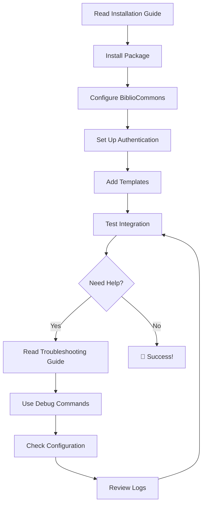

# TPL Shared Package Documentation

Comprehensive documentation for the TPL Shared Laravel package.

## 📋 Documentation Index

### 🚀 Installation

- **[Installation Guide](installation/README.md)** - Complete installation and setup instructions
    - Quick start (5 minutes)
    - Automated install command
    - Manual configuration
    - Package development setup

### 🎯 Features

- **[BiblioCommons Integration](features/bibliocommons.md)** - Complete SSO and template system
    - Authentication system (stateless)
    - Template integration (headers/footers)
    - Cookie utilities for external systems
    - API service usage

### 🛠️ Development

- **[Development Guide](development/README.md)** - Package development workflow
    - Local development setup
    - Code quality standards
    - Testing strategies
    - Build system usage
- **[Version Management](development/VERSION_MANAGEMENT.md)** - Release and version control
    - Semantic versioning
    - Release workflows
    - Cross-platform build tools

### 🐛 Troubleshooting

- **[Troubleshooting Guide](troubleshooting/README.md)** - Complete issue resolution
    - Installation problems
    - Authentication issues
    - Template integration fixes
    - Development environment solutions
    - Performance optimization

---

## 🎯 Quick Start by Role

### 👨‍💻 For Host Application Developers

1. **Install Package:** [Installation Guide](installation/README.md#quick-start-5-minutes)
2. **Set Up Authentication:** [Authentication Setup](features/bibliocommons.md#quick-start-authentication)
3. **Add Templates:** [Template Integration](features/bibliocommons.md#quick-start-templates)

### 🔧 For Package Contributors

1. **Development Setup:** [Development Guide](development/README.md#development-setup)
2. **Code Quality:** [Development Guide → Code Quality](development/README.md#code-quality)
3. **Release Process:** [Version Management](development/VERSION_MANAGEMENT.md#quick-release-recommended)

---

## 🔍 Find What You Need

### By Topic

| Topic              | Location                                                               | Description                 |
| ------------------ | ---------------------------------------------------------------------- | --------------------------- |
| **Installation**   | [Installation Guide](installation/README.md)                           | Complete setup instructions |
| **Authentication** | [BiblioCommons Guide](features/bibliocommons.md#authentication-system) | SSO integration             |
| **Templates**      | [BiblioCommons Guide](features/bibliocommons.md#template-system)       | Header/footer integration   |
| **Cookie Utils**   | [BiblioCommons Guide](features/bibliocommons.md#cookie-utilities)      | External cookie handling    |
| **Development**    | [Development Guide](development/README.md)                             | Package development         |
| **Releasing**      | [Version Management](development/VERSION_MANAGEMENT.md)                | Version control             |
| **Issues**         | [Troubleshooting Guide](troubleshooting/README.md)                     | Problem solving             |

### By Problem

| Problem               | Solution                      | Location                                                                             |
| --------------------- | ----------------------------- | ------------------------------------------------------------------------------------ |
| **Can't install**     | GitHub auth, repository setup | [Installation Issues](troubleshooting/README.md#installation-issues)                 |
| **Auth not working**  | API config, cookie issues     | [Authentication Issues](troubleshooting/README.md#authentication-issues)             |
| **Templates missing** | API URL, cache issues         | [Template Integration Issues](troubleshooting/README.md#template-integration-issues) |
| **Vite errors**       | Host configuration            | [Frontend Development Issues](troubleshooting/README.md#frontend-development-issues) |
| **Version conflicts** | Update, sync versions         | [Version Management Issues](troubleshooting/README.md#version-management-issues)     |

---

## 📦 Package Overview

TPL Shared is a comprehensive Laravel package providing:

- ✅ **BiblioCommons SSO** - Stateless authentication via BiblioCommons API
- ✅ **Template Integration** - Headers, footers, and styling from BiblioCommons
- ✅ **Cookie Utilities** - Read raw cookies from external systems
- ✅ **React Components** - Reusable UI components with TypeScript
- ✅ **Frontend Assets** - Shared CSS and JavaScript
- ✅ **Laravel Integration** - Service providers, middleware, and commands

**Tech Stack:**

- PHP 8.4+ with Laravel 12.x
- React 19 with TypeScript
- Inertia.js v2 for frontend routing
- Tailwind CSS v4 for styling
- Vite for asset bundling

---

## 🚀 Getting Started Flow



---

## 🎓 Learning Paths

### Path 1: Quick Integration (15 minutes)

1. [Quick Start Installation](installation/README.md#quick-start-5-minutes)
2. [Authentication Setup](features/bibliocommons.md#quick-start-authentication)
3. [Template Integration](features/bibliocommons.md#quick-start-templates)
4. ✅ **Done!** Your app has BiblioCommons integration

### Path 2: Comprehensive Understanding (1 hour)

1. [Complete Installation Guide](installation/README.md)
2. [BiblioCommons Architecture](features/bibliocommons.md#architecture)
3. [Advanced Authentication](features/bibliocommons.md#advanced-usage)
4. [Customization Options](features/bibliocommons.md#customization)
5. [Testing Strategies](development/README.md#testing-strategies)

### Path 3: Package Developer (2 hours)

1. [Development Setup](development/README.md#development-setup)
2. [Code Quality Standards](development/README.md#code-quality)
3. [Testing and Building](development/README.md#build-system)
4. [Release Process](development/VERSION_MANAGEMENT.md#release-workflows)
5. [Contributing Guidelines](development/README.md#contributing-guidelines)

---

## 📞 Getting Help

### Self-Service

- **[Troubleshooting Guide](troubleshooting/README.md)** - Comprehensive issue resolution
- **[Diagnostic Commands](troubleshooting/README.md#quick-diagnosis)** - Automated health checks

### Community

- **GitHub Issues:** https://github.com/tpl-eservices/tpl-shared/issues
- **Documentation Feedback:** Create issue with `documentation` label

### Direct Support

- **TPL Development Team:** Contact directly for urgent issues
- **Office Hours:** [Schedule consultation] (internal team link)

---

## 🔄 Documentation Updates

This documentation is continuously updated. To suggest improvements:

1. **Create an Issue:** [GitHub Issues](https://github.com/tpl-eservices/tpl-shared/issues)
2. **Submit a PR:** Edit documentation directly
3. **Contact Team:** Reach out to documentation maintainers

### Last Updated

- **Installation Guide:** Updated with automated install command
- **BiblioCommons Guide:** Consolidated SSO and template docs
- **Development Guide:** Added cross-platform build instructions
- **Troubleshooting:** Comprehensive issue resolution matrix

---

## 🔗 Quick Reference Commands

### Package Management

```bash
# Install package
composer require tpl/shared:^0.1.0

# Automated setup
php artisan tpl-shared:install

# Diagnose issues
php artisan bibliocommons:diagnose

# Clear cache
php artisan tpl-shared:clear-cache
```

### Development

```bash
# Unix/Linux/Mac
make release

# Windows PowerShell
.\build.ps1 release

# Windows Batch
build release
```

---

**Built with ❤️ for Toronto Public Library**

_For the most up-to-date information, check the GitHub repository and individual guide files._
